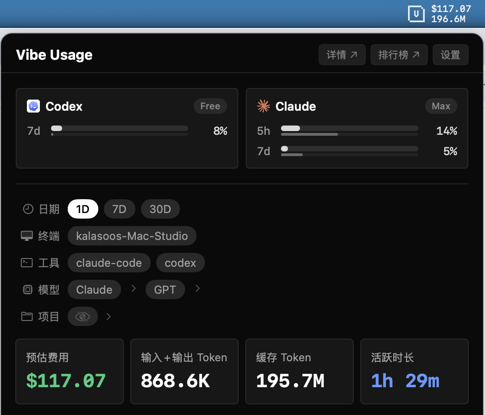
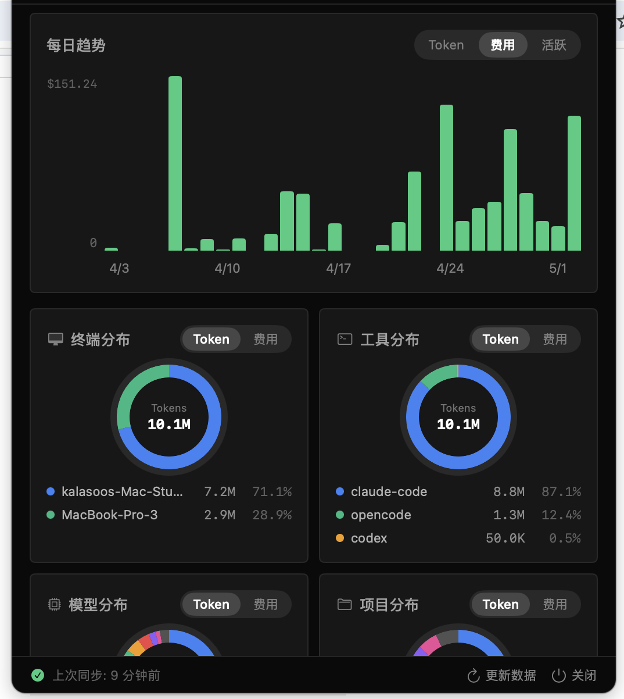

# Vibe Usage

macOS 应用，自动追踪 AI 编程工具的 Token 用量和费用。App 常驻菜单栏，可选显示在 Dock / Cmd-Tab；数据同步到 [vibecafe.ai/usage](https://vibecafe.ai/usage)。

<table align="center">
  <tr>
    <td></td>
    <td></td>
  </tr>
</table>

## 下载

从 [Releases](https://github.com/vibe-cafe/vibe-usage-app/releases/latest) 下载 `VibeUsage.dmg`，打开后将 `Vibe Usage.app` 拖入 Applications 文件夹。

## 配置

1. 打开 Vibe Usage，点击「登录并链接数据」
2. 浏览器自动打开 vibecafe.ai 审批页面 — 登录后确认验证码与 app 一致
3. 点击「确认链接」 — app 自动拿到 Key 并开始同步

## 功能

- 菜单栏常驻；可选显示在 Dock / Cmd-Tab，切换到 Vibe Usage 时自动打开用量面板
- 后台每 30 分钟自动同步数据，也可手动「更新数据」
- 弹出窗口查看费用、总 Token、缓存 Token、趋势图表
- **订阅配额监控**：本地读取 Codex / Claude 的 5 小时 / 7 天 token 配额，悬停查看消耗 vs 时间对比
- 支持今天 / 24H / 7D / 30D / 90D / 自定义日期，以及终端 / 工具 / 模型 / 项目筛选
- 可在菜单栏显示今日费用和 Token 数
- 可在设置中显示或隐藏 Dock 图标
- 支持开机自启动

## 系统要求

- macOS 14 (Sonoma) 或更高版本
- [Node.js](https://nodejs.org) (v20+) 或 [Bun](https://bun.sh)

## 从源码构建

```bash
git clone https://github.com/vibe-cafe/vibe-usage-app.git
cd vibe-usage-app
./scripts/build-app.sh
open "dist/Vibe Usage.app"
```

## 相关项目

- [@vibe-cafe/vibe-usage](https://github.com/vibe-cafe/vibe-usage) — 命令行同步工具
- [vibecafe.ai/usage](https://vibecafe.ai/usage) — Web 仪表盘

## License

MIT
