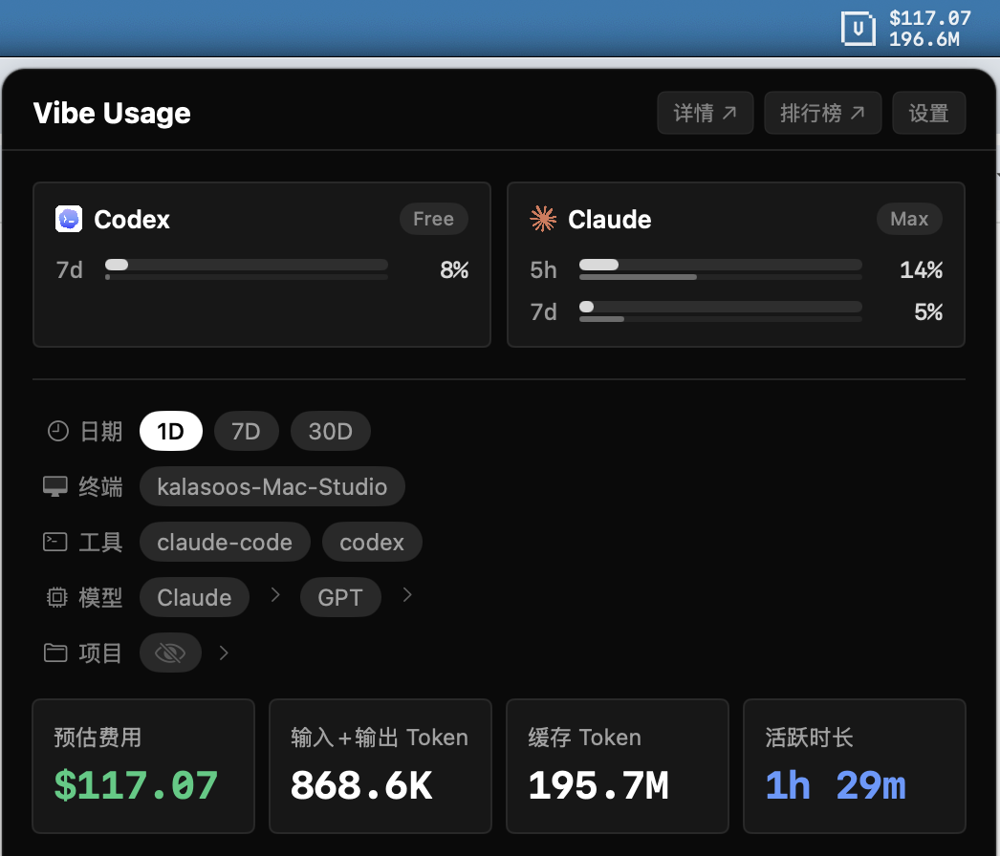
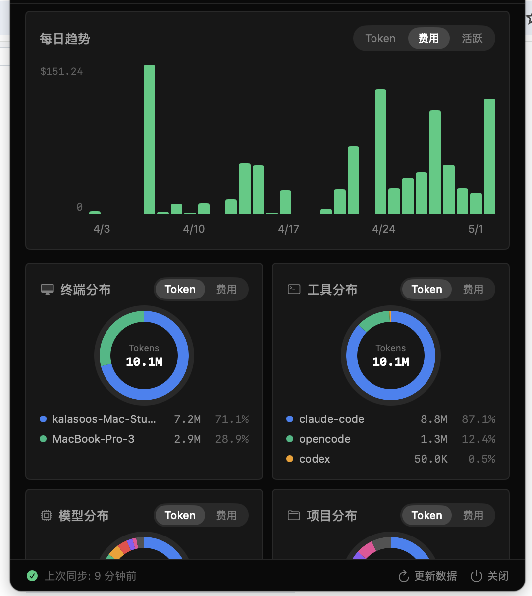

# Vibe Usage

macOS 应用，自动追踪 AI 编程工具的 Token 用量和费用。App 常驻菜单栏，可选显示在 Dock / Cmd-Tab；数据同步到 [vibecafe.ai/usage](https://vibecafe.ai/usage)。

<table align="center">
  <tr>
    <td></td>
    <td></td>
  </tr>
</table>

## 下载

从 [Releases](https://github.com/vibe-cafe/vibe-usage-app/releases/latest) 下载 `VibeUsage.dmg`，打开后将 `Vibe Usage.app` 拖入 Applications 文件夹。

## 配置

1. 打开 Vibe Usage，点击「登录并链接数据」
2. 浏览器自动打开 vibecafe.ai 审批页面 — 登录后确认验证码与 app 一致
3. 点击「确认链接」 — app 自动拿到 Key 并开始同步

## 功能

- 菜单栏常驻；可选显示在 Dock / Cmd-Tab，切换到 Vibe Usage 时自动打开用量面板
- 后台每 30 分钟自动同步数据，也可手动「更新数据」
- 弹出窗口查看费用、总 Token、缓存 Token、趋势图表
- **订阅配额监控**：自动识别 Codex、Claude、Kimi Code、ZCode、Grok、OpenCode Go 和 Cursor，可按选择顺序为每个已启用产品显示一张卡片（双列向下排列，卡片自动换行）。Codex、Claude 和 Kimi 复用各自本机官方客户端的登录状态；Kimi 的短期 access token 由共享 CLI 通过标准 OAuth 自动、安全轮换。ZCode 支持 BigModel（国内）与 Z.ai（海外），仅使用用户显式输入并按区域分别保存在 Vibe Usage 自有 Keychain 项中的 Coding Plan API Key。Grok 只从官方 CLI 普通日志的结构化 billing 事件读取当前订阅百分比、周期和方案，不联网、不读取凭据，也不保留其他日志字段。OpenCode Go 在 App 内原生读取 OpenCode 自己的 Go key（先看凭据表，再回退到 1.x 的 auth.json），调用官方 usage 接口展示 5 小时 / 每周 / 每月三个窗口；key 只作请求头，不落盘、不缓存、不写日志，未订阅 Go 的账号显示「未订阅 OpenCode Go」。Cursor 可单独选择并显示待接入状态，但在官方稳定配额接口出现前不会读取登录 Token、Cookie、其他应用 Keychain、网络流量或界面。只有选中的可读取产品才会启动读取或联网；单个产品失败不影响另一张卡片- 支持今天 / 24H / 7D / 30D / 90D / 自定义日期，以及终端 / 工具 / 模型 / 项目筛选
- 可在菜单栏显示今日费用和 Token 数；菜单栏显示、开机自启动与 Dock 图标开关集中在「设置 → 常规」
- 可在订阅配额选择器和设置中选择、排序任意数量的产品；首次运行只自动选择已检测且可用的产品，未选择的产品不显示也不读取
- 可在设置中为 Codex、Grok、Antigravity / AGY 添加多个 Multica 或其他隔离运行时目录（「设置 → 数据目录（高级）」）；旧版单一 Codex Home 配置和各工具默认目录仍会继续扫描
- 设置页按用途分组：同步账号与状态在最上面，然后是订阅配额选择（每个产品行带官方图标；点开 ZCode 行即可选择区域并填写 API Key）与常规开关，低频/高级项（数据来源说明与重新检测、额外扫描目录、更新、重置）收在折叠分组或页尾，功能没有任何删减

## 系统要求

- macOS 14 (Sonoma) 或更高版本
- [Node.js](https://nodejs.org) (v20+) 或 [Bun](https://bun.sh)

## 从源码构建

```bash
git clone https://github.com/vibe-cafe/vibe-usage-app.git
cd vibe-usage-app
./scripts/build-app.sh              # host architecture
./scripts/build-app.sh --universal  # arm64 + x86_64 (Intel + Apple Silicon)
./scripts/build-app.sh --external-test --cli-source ../vibe-usage --universal --notarize  # signed external test build
open "dist/Vibe Usage.app"
```

### 测试诊断（仅 Debug）

Debug 构建的设置页提供“导出诊断日志”入口。日志仅保存在当前 macOS 用户的 `~/Library/Logs/Vibe Usage/`，只记录结构化错误码、Provider、App/系统版本和配额 meter 数量，不记录 API Key、OAuth Token、请求头、响应正文、账号信息或本机路径。Release 构建会在编译期移除日志写入实现和导出入口。

维护者请参阅[发布与更换发布 Mac 指南](docs/RELEASING.md)，尤其是在另一台 Mac 上生成 Sparkle 更新之前迁移并校验当前签名密钥。

## 相关项目

- [@vibe-cafe/vibe-usage](https://github.com/vibe-cafe/vibe-usage) — 命令行同步工具
- [vibecafe.ai/usage](https://vibecafe.ai/usage) — Web 仪表盘

## License

MIT
